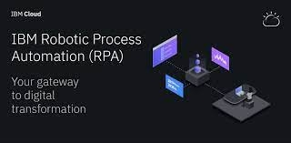

`		`**ROBOTIC PROCESS AUTOMATION IUCEE ASSIGNMENT**

**Robotic process automation (RPA),** also known as software robotics, uses intelligent automation technologies to perform repetitive office tasks of human workers.

Robotic process automation (RPA), also known as software robotics, uses automation technologies to mimic back-office tasks of human workers, such as extracting data, filling in forms, moving files, et cetera. It combines APIs and user interface (UI) interactions to integrate and perform repetitive tasks between enterprise and productivity applications. By deploying scripts which emulate human processes, RPA tools complete autonomous execution of various activities and transactions across unrelated software systems.

This form of automation uses rule-based software to perform business process activities at a high-volume, freeing up human resources to prioritize more complex tasks. RPA enables CIOs and other decision makers to accelerate their digital transformation efforts and generate a higher return on investment (ROI) from their staff.

ccording to Forrester, RPA software tools must include the following core capabilities:

Low-code capabilities to build automation scripts

Integration with enterprise applications

Orchestration and administration including configuration, monitoring and security

Automation technology, like RPA, can also access information through legacy systems, integrating well with other applications through front-end integrations. This allows the automation platform to behave similarly to a human worker, performing routine tasks, such as logging in and copying and pasting from one system to another. While back-end connections to databases and enterprise web services also assist in automation, RPA’s real value is in its quick and simple front-end integrations.

**The benefits of RPA**

There are multiple benefits of RPA, including:

Less coding: RPA does not necessarily require a developer to configure; drag-and-drop features in user interfaces make it easier to onboard non-technical staff.

Rapid cost savings: Since RPA reduces the workload of teams, staff can be reallocated towards other priority work that does require human input, leading to increases in productivity and ROI. 

Higher customer satisfaction: Since bots and chatbots can work around the clock, they can reduce wait times for customers, leading to higher rates of customer satisfaction.

Improved employee morale: By lifting repetitive, high-volume workload off your team, RPA allows people to focus on more thoughtful and strategic decision-making. This shift in work has a positive effect on employee happiness.

Better accuracy and compliance: Since you can program RPA robots to follow specific workflows and rules, you can reduce human error, particularly around work which requires accuracy and compliance, like regulatory standards. RPA can also provide an audit trail, making it easy to monitor progress and resolve issues more quickly.

Existing systems remain in place: Robotic process automation software does not cause any disruption to underlying systems because bots work on the presentation layer of existing applications. So, you can implement bots in situations where you don’t have an application programming interface (API) or the resources to develop deep integrations.

`             `

**What is robotic process automation (RPA)?**

Robotic process automation (RPA), also known as software robotics, uses automation technologies to mimic back-office tasks of human workers, such as extracting data, filling in forms, moving files, et cetera. It combines APIs and user interface (UI) interactions to integrate and perform repetitive tasks between enterprise and productivity applications. By deploying scripts which emulate human processes, RPA tools complete autonomous execution of various activities and transactions across unrelated software systems.

This form of automation uses rule-based software to perform business process activities at a high-volume, freeing up human resources to prioritize more complex tasks. RPA enables CIOs and other decision makers to accelerate their digital transformation efforts and generate a higher return on investment (ROI) from their staff.

**What is Robotic Process Automation (RPA)?**

RPA and intelligent automation

In order for RPA tools in the marketplace to remain competitive, they will need to move beyond task automation and expand their offerings to include intelligent automation (IA). This type of automation expands on RPA functionality by incorporating sub-disciplines of artificial intelligence, like machine learning, natural language processing, and computer vision.  

Intelligent process automation demands more than the simple rule-based systems of RPA. You can think of RPA as “doing” tasks, while AI and ML encompass more of the “thinking” and "learning," respectively. It trains algorithms using data so that the software can perform tasks in a quicker, more efficient way.

**RPA and artificial intelligence**

Robotic process automation is often mistaken for artificial intelligence (AI), but the two are distinctly different. AI combines cognitive automation, machine learning (ML), natural language processing (NLP), reasoning, hypothesis generation and analysis.

The critical difference is that RPA is process-driven, whereas AI is data-driven. RPA bots can only follow the processes defined by an end user, while AI bots use machine learning to recognize patterns in data, in particular unstructured data, and learn over time. Put differently, AI is intended to simulate human intelligence, while RPA is solely for replicating human-directed tasks. While the use of artificial intelligence and RPA tools minimize the need for human intervention, the way in which they automate processes is different. 

That said, RPA and AI also complement each other well. AI can help RPA automate tasks more fully and handle more complex use cases. RPA also enables AI insights to be actioned on more quickly instead of waiting on manual implementations.

**How does RPA work?**

According to Forrester, RPA software tools must include the following core capabilities:

Low-code capabilities to build automation scripts

Integration with enterprise applications

Orchestration and administration including configuration, monitoring and security

Automation technology, like RPA, can also access information through legacy systems, integrating well with other applications through front-end integrations. This allows the automation platform to behave similarly to a human worker, performing routine tasks, such as logging in and copying and pasting from one system to another. While back-end connections to databases and enterprise web services also assist in automation, RPA’s real value is in its quick and simple front-end integrations.

**The benefits of RPA**

There are multiple benefits of RPA, including:

**Less coding**: RPA does not necessarily require a developer to configure; drag-and-drop features in user interfaces make it easier to onboard non-technical staff.

**Rapid cost savings**: Since RPA reduces the workload of teams, staff can be reallocated towards other priority work that does require human input, leading to increases in productivity and ROI. 

**Higher customer satisfaction**: Since bots and chatbots can work around the clock, they can reduce wait times for customers, leading to higher rates of customer satisfaction.

**Improved employee morale:** By lifting repetitive, high-volume workload off your team, RPA allows people to focus on more thoughtful and strategic decision-making. This shift in work has a positive effect on employee happiness.

Better accuracy and compliance: Since you can program RPA robots to follow specific workflows and rules, you can reduce human error, particularly around work which requires accuracy and compliance, like regulatory standards. RPA can also provide an audit trail, making it easy to monitor progress and resolve issues more quickly.

Existing systems remain in place: Robotic process automation software does not cause any disruption to underlying systems because bots work on the presentation layer of existing applications. So, you can implement bots in situations where you don’t have an application programming interface (API) or the resources to develop deep integrations.

To learn more about what’s required of business users to set up RPA tools, read on in our blog here.

**Challenges of RPA**

While RPA software can help an enterprise grow, there are some obstacles, such as organizational culture, technical issues and scaling.

**Organizational culture**

While RPA will reduce the need for certain job roles, it will also drive growth in new roles to tackle more complex tasks, enabling employees to focus on higher-level strategy and creative problem-solving. Organizations will need to promote a culture of learning and innovation as responsibilities within job roles shift. The adaptability of a workforce will be important for successful outcomes in automation and digital transformation projects. By educating your staff and investing in training programs, you can prepare teams for ongoing shifts in priorities.

**Difficulty in scaling**

While RPA can perform multiple simultaneous operations, it can prove difficult to scale in an enterprise due to regulatory updates or internal changes. According to a Forrester report, 52% of customers claim they struggle with scaling their RPA program. A company must have 100 or more active working robots to qualify as an advanced program, but few RPA initiatives progress beyond the first 10 bots.

**RPA use cases**

There are several industries that leverage RPA technology to streamline their business operations. RPA implementations can be found across the following industries:

**Banking and financial services**: In the Forrester report on “The RPA Services Market Will Grow To Reach USD 12 Billion By 2023”, 36% of all use cases were in the finance and accounting space. More than 1 in 3 bots today are in the financial industry, which is of little surprise given banking's early adoption of automation. Today, many major banks use RPA automation solutions to automate tasks, such as customer research, account opening, inquiry processing and anti-money laundering. A bank deploys thousands of bots to automate manual high-volume data entry. These processes entail a plethora of tedious, rule-based tasks that automation streamlines.

**Insurance:** Insurance is full of repetitive processes well suited for automation. For example, you can apply RPA to claims processing operations, regulatory compliance, policy management and underwriting tasks.

**Retail:** The rise of ecommerce has made RPA an integral component of the modern retail industry that has improved back office operations and the customer experience. Popular applications include customer relationship management, warehouse and order management, customer feedback processing and fraud detection.

**Healthcare:** Accuracy and compliance are paramount in the health care industry. Some of the world's largest hospitals use robotic process automation software to optimize information management, prescription management, insurance claim processing and payment cycles, among other processes.

Some of the examples were:

`   `        
